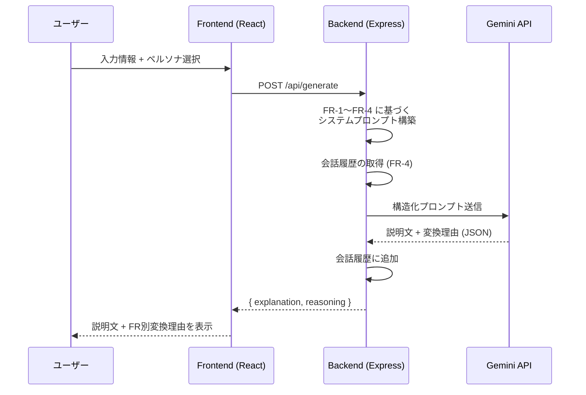

# NEMT - ペルソナ適応型説明生成システム

**N**emotron **E**pistemic **M**apping **T**ranslator

入力された事実や説明文を、指定されたペルソナにとって最も適切な表現へ変換し、その変換理由を併せて提示する Web チャットアプリケーションです。

> 論文 [Are Conversational AI Agents the Way Out?](https://arxiv.org/pdf/2601.18772v1) の枠組みに基づき、動的認識論的翻訳・価値連鎖マッピング・適応的対話プロトコル・文脈状態管理を統合しています。

---

## ✨ 特徴

| 機能要件 | 概要 |
|---------|------|
| **FR-0** ペルソナ適応型説明生成 | 入力情報をペルソナに最適化された表現へ変換し、変換理由も提示 |
| **FR-1** 動的認識論的翻訳 | 専門用語をペルソナの知識レベルに合わせて翻訳（比喩・具体例の活用） |
| **FR-2** 価値連鎖マッピング | マクロ情報をペルソナの生活・目標への影響として自分事化 |
| **FR-3** 適応的対話プロトコル | 性格・話し方に合わせたトーン・伝達様式の調整 |
| **FR-4** 文脈状態管理 | 過去の会話履歴を踏まえた継続的な文脈提供 |

## 🗂️ ペルソナデータ

[NVIDIA Nemotron-Personas-Japan](https://huggingface.co/datasets/nvidia/Nemotron-Personas-Japan) から 1,000 件のペルソナを使用。各ペルソナは以下の属性を持ちます：

- **基本情報**: 名前、年齢、性別、婚姻状況、都道府県
- **職業・学歴**: 職業、学歴、スキル・専門知識
- **趣味・関心**: 趣味、文化的背景、キャリア目標
- **ペルソナ描写**: 職業 / スポーツ / 芸術 / 旅行 / 料理 の各視点からの人物像

---

## 🚀 セットアップ

### 前提条件

- [Node.js](https://nodejs.org/) v18 以上
- [Google Gemini API Key](https://aistudio.google.com/apikey)

### インストール

```bash
git clone https://github.com/yujisakata/nemt.git
cd nemt
npm install
```

### 環境変数の設定

```bash
cp .env.example .env
```

`.env` を編集し、Gemini API キーを設定：

```env
GEMINI_API_KEY=your_gemini_api_key_here
```

### ペルソナデータのダウンロード

HuggingFace から 1,000 件のペルソナをダウンロードします：

```bash
npm run download-personas
```

---

## ▶️ 起動

ターミナルを **2つ** 開いて、それぞれ実行してください：

```bash
# ターミナル 1: バックエンド (Express, ポート 3001)
npm run server

# ターミナル 2: フロントエンド (Vite, ポート 5173)
npm run dev
```

ブラウザで **http://localhost:5173/** にアクセスし、ペルソナを選択してチャットを開始します。

---

## 🏗️ アーキテクチャ

```
nemt/
├── server/
│   ├── server.js             # Express API サーバー
│   ├── personaEngine.js      # FR-0〜FR-4 統合ロジック + Gemini API
│   ├── stateManager.js       # 会話履歴の永続化 (FR-4)
│   ├── downloadPersonas.js   # HuggingFace データダウンロード
│   └── data/
│       ├── personas.json     # ダウンロード済みペルソナ (1000件)
│       └── conversations/    # ペルソナ別会話履歴
├── src/
│   ├── main.jsx              # React エントリポイント
│   ├── App.jsx               # メインレイアウト
│   ├── index.css             # ダークテーマ UI スタイル
│   └── components/
│       ├── ChatArea.jsx      # チャット UI
│       ├── PersonaPanel.jsx  # ペルソナ検索・選択パネル
│       └── ReasoningDisplay.jsx  # 変換理由表示 (FR-1〜FR-4)
├── index.html
├── vite.config.js
├── package.json
└── .env.example
```

### API エンドポイント

| メソッド | パス | 説明 |
|---------|------|------|
| `GET` | `/api/personas` | ペルソナ一覧（検索・フィルタ対応） |
| `GET` | `/api/personas/:uuid` | ペルソナ詳細 |
| `GET` | `/api/personas/random/:count` | ランダムペルソナ取得 |
| `GET` | `/api/filters` | フィルタ選択肢（都道府県・職業） |
| `POST` | `/api/generate` | ペルソナ適応型説明生成 |
| `GET` | `/api/history/:uuid` | 会話履歴取得 |
| `DELETE` | `/api/history/:uuid` | 会話履歴削除 |

### 説明生成フロー



---

## 📄 技術スタック

| 項目 | 技術 |
|------|------|
| フロントエンド | React + Vite |
| バックエンド | Express.js (Node.js) |
| LLM | Google Gemini API (`gemini-flash-latest`) |
| ペルソナデータ | [Nemotron-Personas-Japan](https://huggingface.co/datasets/nvidia/Nemotron-Personas-Japan) (CC BY 4.0) |
| データ永続化 | ローカル JSON ファイル |

## 📚 参考文献

- 論文: [Are Conversational AI Agents the Way Out? Co-Designing Reader-Oriented News Experiences with Immigrants and Journalists](https://arxiv.org/pdf/2601.18772v1)
- データセット: [NVIDIA Nemotron-Personas-Japan](https://huggingface.co/datasets/nvidia/Nemotron-Personas-Japan)

## 📝 ライセンス

MIT